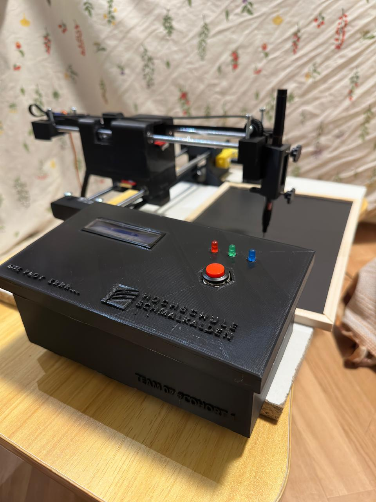
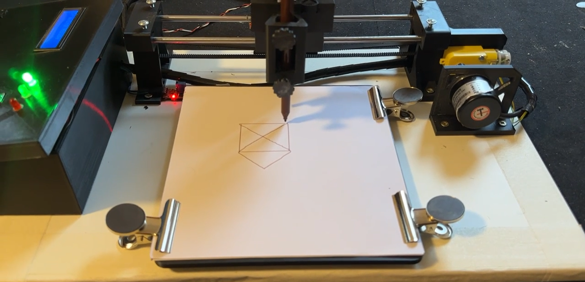

# XY Pen-Plotter  

This project is a **high-precision XY Pen Plotter** developed as part of the **Master of Engineering in Mechatronics and Robotics** program at Schmalkalden University of Applied Sciences.  
The plotter uses an **ESP32 microcontroller** to achieve **0.01 mm motion accuracy** via **interrupt-driven control** and **1200 PPR rotary encoder feedback**, enabling it to create intricate drawings like the *Nikolaus Haus*.  

The repository contains the **Arduino firmware** for controlling the plotter, including motor control, encoder signal processing, safety mechanisms, and communication with a PC-based interface.  

---

## Images  

### XY Pen-Plotter  
  

### Example Output – Nikolaus Haus  
  

---
